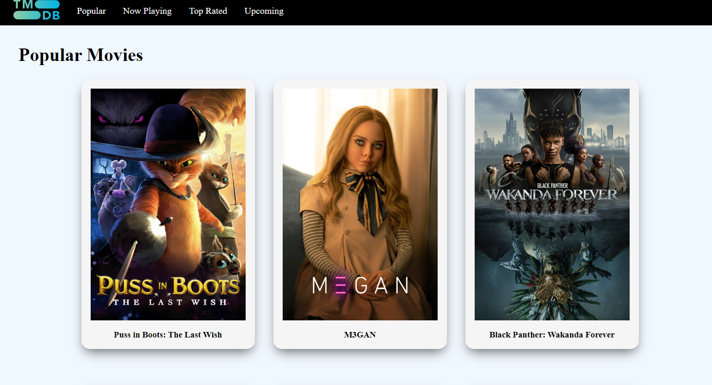
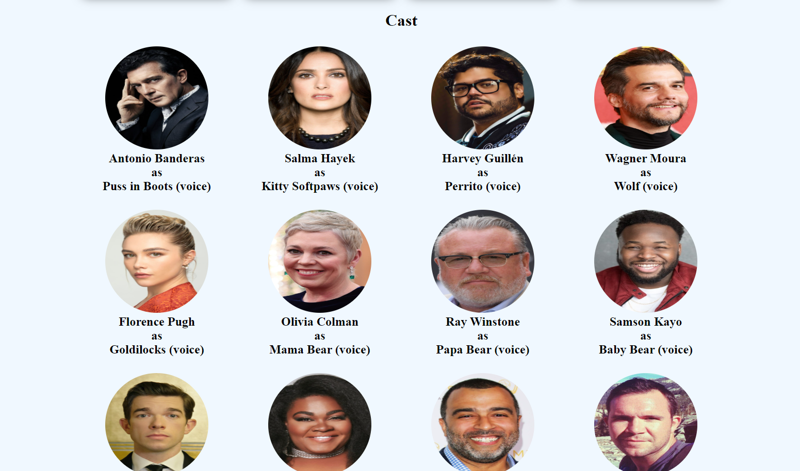

# Movies App - NextJS

## :link:	Live Demo 
[Demo Link](https://movies-nextjs-one.vercel.app/movies)

## 📷 Screenshot

### Home Page
  
  
### Movie Page
  
  
### Cast 
  

## 📝 Project Description

The Movies App project allows users to view the list of the top movies in real time. Moreover, the users are able to see a list of similar movies based on the movie they selected previously as well as the cast for it.

## 📚 Technologies

- ReactJS
- NextJS
- CSS

## :compass: Roadmap

- [x] Fetch movies
- [x] Add similar movies component
- [x] Add cast component
- [ ] Filter by category
- [ ] Search bar

## :star:	Acknowledgements
- [Themoviedb](https://www.themoviedb.org/)
